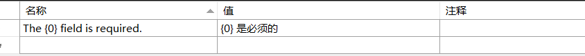
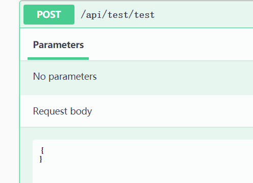
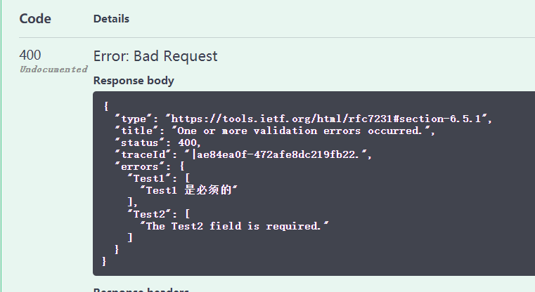

### 环境

- dotnet core 3.1 LTS

### 需求

- 为了让WEB API后端支持中文友好信息（只是我单纯的前端不想多写判断代码而已。。。），想把原本的ModelError英文变成中文返回
- 当然数据验证可以重构一个中文版本，但是毕竟官方有轮子何必自己造轮子呢。

<!-- more -->

### 配置Startup类

#### ConfigureService
``` csharp
services.AddLocalization(options => options.ResourcesPath = "Resources");

services.AddControllers().AddDataAnnotationsLocalization(o =>
            {
                o.DataAnnotationLocalizerProvider = (type, factory) => factory.Create(typeof(SharedResource));
            });
            
services.Configure<RequestLocalizationOptions>(options =>
            {
                var supportedCultures = new List<CultureInfo>
                {
                    new CultureInfo("zh-CN"),
                };

                options.DefaultRequestCulture = new RequestCulture("zh-CN");
                options.SupportedCultures = supportedCultures;
                options.SupportedUICultures = supportedCultures;
            });
```

#### Configure
``` csharp
var defaultCulture = new CultureInfo("zh-CN");
            var localizationOptions = new RequestLocalizationOptions
            {
                DefaultRequestCulture = new RequestCulture(defaultCulture),
                SupportedCultures = new List<CultureInfo> { defaultCulture },
                SupportedUICultures = new List<CultureInfo> { defaultCulture }
            };
            app.UseRequestLocalization(localizationOptions);
```

#### 配置虚拟共享类

前一步ConfigureService里有个SharedResource类，根据官方文档所设置的虚类
目录放在Project.API.SharedResource.cs  
``` csharp
namespace Project.API
{
    public class SharedResource
    {

    }
}
```

#### 创建资源映射文件

在项目Project根目录下创建Configure中options.ResourcePath对应的文件夹,在该文件夹中创建API.SharedResource.zh-CN.resx资源文件如下图所示


#### 测试用例

新建TestController.cs控制器
``` csharp
[Route("api/test/[action]")]
    [ApiController]
    public class TestController : ControllerBase
    {
        private IStringLocalizer _localizer;

        public TestController(IStringLocalizerFactory localizerFactory)
        {
            var type = typeof(SharedResource);
            var assemblyName = new AssemblyName(type.GetTypeInfo().Assembly.FullName);
            _localizer = localizerFactory.Create(typeof(SharedResource));
        }

        [HttpPost]
        public ActionResult test([FromBody]Test test)
        {
            return BadRequest(new
            {
                message = _localizer["{0} is required"]
            });
        }


    }
    public class Test
    {
        [Required(ErrorMessage = "The {0} field is required.")]
        public string Test1 { get; set; }

        [Required]
        public  string Test2 { get; set; }
    }
```

#### Swagger 测试

将body删除空白，然后提交



#### 结果

如下图所示，可以看出当前映射已经生效了


#### 不过这里Test2还是没有更改

之后再进行研究一下