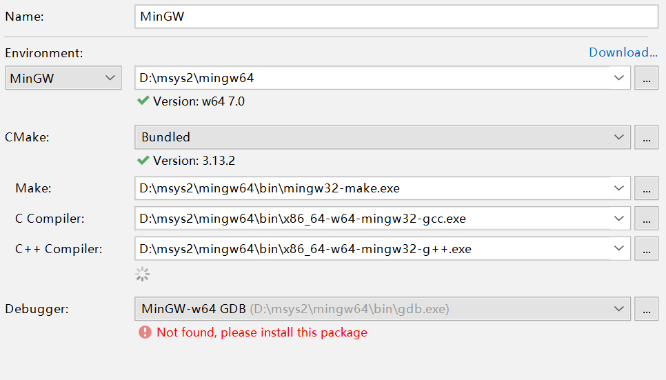
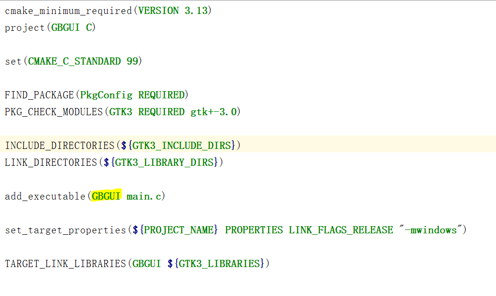

### GTKwin配置+Clion IDE配置

<!-- more -->
#### 环境
- windows 10 x86_64
- [msys2][1]

#### 准备[GTK官方download指南][2]
1. 打开msys2 64位控制台
2. `pacman -S mingw-w64-x86_64-gtk3`下载gtk3
3. `pacman -S mingw-w64-x86_64-toolchain base-devel` 下载gcc等编译工具，包含Pkg-config

*`pacman`类似于yum和apt-get的软件包管理工具*

#### 下载完毕后设置win环境变量

1. 此电脑-属性（R）-高级系统设置-环境变量
    1. 新增变量`C_INCLUDE_PATH` 值`msys的地址\mingw64\include`
    2. 新增变量`LIBRARY_PATH` 值`msys的地址\mingw64\lib`
    3. 新增变量`MINGW_HOME` 值`msys的地址\mingw64`
    4. `PATH`变量新增值 `%MINGW_HOME%\bin`
2. 测试是否成功
    1. 打开powershell或者cmd
    2. 测试`gcc -v`和`pkg-config --cflags gtk+-3.0`
    3. 若正确显示版本号和库文件包含即为安装完毕

#### CLION IDE 配置debug和release

1. File-Setting-Toolchian 配置如图
  

2. 在Setting里选择CMake添加在profiles里添加Release（会自动生成）

3. 修改CMakeList.txt

  

  *FIND_PACKAGE 包管理寻找*
  *PKG_CHECK_MODULES 包模块检查*
  *INCLUDE_DIRECTORIES 库路径搜索*
  *LINK_DIRECTORIES 动态链接库搜索*
  *set_target_properties 设置目标属性-只有release下有效*
  *TARGET_LINK_LIBRARIES 生成的文件链接动态库*

#### 配置完成即可欢快的写GTK程序了

#### 运行包包装
1. 复制`msys2地址\mingw64\bin\*.dll`文件
2. 复制`msys2地址\lib\gdk-pixbuf-2.0\*`文件
3. 复制`msys2地址\share\icons\*`文件
4. 复制的文件目录`./bin ./lib ./share`
5. 将执行文件放于bin中，最后打包在一个文件夹即可

[1]: https://msys2.github.io/
[2]: https://www.gtk.org/download/windows.php