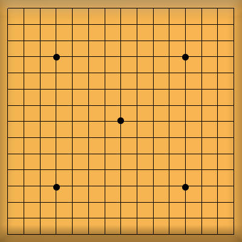
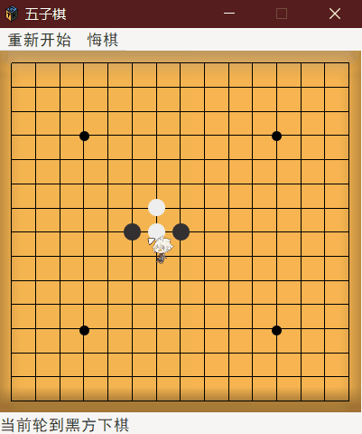

## C基础课外编程项目——五子棋
### 在控制台命令行实现五子棋
*IDE Code::Block GCC 8.10 Win32*

### 基础版命令行五子棋
1. 命令行输入坐标下棋
2. 命令行显示棋盘过程（刷新使用全局刷新cls）
3. 能自动判断输赢

<!-- more -->

### 代码实现（分为三个部分）
1. 棋盘类
2. 裁判类
3. 显示函数

### 头文件部分
``` c
#include <stdio.h>
#include <string.h>
#include <ctype.h>
#include <time.h>
#include <stdlib.h>//用来调用system函数
```

### 棋盘类
``` C
typedef struct GobangBoard{//定义五子棋类
    int Width,Height; //定义棋盘的长和宽
    short Graph[maxSize][maxSize]; //棋盘图形
}Board;
void initBoard(Board * thisB,int Height,int Width);//定义初始化
void displayBoard(Board * thisB,int shiftSize); //打印棋盘,shiftSize棋盘向右偏移的位置，为了居中
```
### 裁判类
```c
typedef struct autoReferee{//定义游戏裁判
    int turn; //回合
    short firstIs; //定义先下的一方，0是黑方，1是白方
    short nowIs; //定义当前下的一方
    int endX,endY; //最后一步的位置
}BoardRef;
void initRef(BoardRef * thisB); //初始化棋盘裁判
```

### 基础版完整实现代码
``` C
//定义变量temp开头为临时变量

#include <stdio.h>
#include <string.h>
#include <ctype.h>
#include <time.h>
#include <stdlib.h>

#define maxSize 21 //棋盘最大的大小
#define defaultShiftSize 0  //输出右偏移的格数

typedef struct GobangBoard{//定义五子棋类
    int Width,Height; //定义棋盘的长和宽
    short Graph[maxSize][maxSize]; //棋盘图形
}Board;

typedef struct autoReferee{//定义游戏裁判
    int turn; //回合
    short firstIs; //定义先下的一方，0是黑方，1是白方
    short nowIs; //定义当前下的一方
    int endX,endY; //最后一步的位置
}BoardRef;

void echo(char str[],int shiftSize);//定义用以回显文字部分，加偏移值

void initBoard(Board * thisB,int Height,int Width);//定义初始化棋盘

void initRef(BoardRef * thisB); //初始化棋盘裁判

int checkVictoryRef(BoardRef * thisBr,Board * thisBo);//检查是否满足胜利条件，参数（裁判类，棋盘类）返回胜利的一方，否则返回-1

//显示函数
void displayBoard(Board * thisB,int shiftSize); //打印棋盘,shiftSize棋盘向右偏移的位置，为了居中
void displayMenu1(int shiftSize);//定义显示游戏主菜单
void displayTurn(BoardRef * thisBr,int shiftSize);//显示游戏回合
void displayWinner(int who,int shiftSize);//显示游戏获胜方

Board gameBoard; //游戏类变量
BoardRef gameRef;


int main(){
    while (1){
        system("cls");
        displayMenu1(defaultShiftSize);
        char tempChoice;
        scanf("%c",&tempChoice);
        while (getchar()!='\n');
        if (tempChoice=='Y' || tempChoice =='y'){

            initRef(&gameRef);

            initBoard(&gameBoard,5,5);

            while (1){ //游戏开始
                system("cls");
                displayBoard(&gameBoard,defaultShiftSize);
                displayTurn(&gameRef,defaultShiftSize);
                int tempX,tempY;
                while (scanf("%d %d",&tempY,&tempX)==0 || tempY>=maxSize || tempX >=maxSize ||
                       tempY<=0 || tempX<=0 || gameBoard.Graph[tempY][tempX]<2){
                    setbuf(stdin,NULL);  //用于去除数字以外的其它杂余字符的缓冲
                    system("cls");
                    displayBoard(&gameBoard,defaultShiftSize);
                    echo("非法输入!\n",defaultShiftSize);
                    displayTurn(&gameRef,defaultShiftSize);

                };
                //更新棋盘裁判
                gameRef.endX=tempX,gameRef.endY=tempY;

                gameBoard.Graph[tempY][tempX]=gameRef.nowIs;


                int tempFlag=-1;//临时变量检查是否满足胜利条件
                tempFlag=checkVictoryRef(&gameRef,&gameBoard);
                if (tempFlag==-1 && gameRef.turn==gameBoard.Height*gameBoard.Width) tempFlag=-2;

                if (tempFlag!=-1){
                    //显示胜利
                    system("cls");
                    displayBoard(&gameBoard,defaultShiftSize);
                    displayWinner(tempFlag,defaultShiftSize);
                    break;
                };
                //更新下一步
                gameRef.turn++;
                gameRef.nowIs^=1;
            };
        }else if (tempChoice=='Q' || tempChoice =='q'){//退出游戏
            exit(0);
        };
    }
    return 0;
}

void echo(char str[],int shiftSize){//用以回显文字部分，加偏移值
    int tempi;
    for (tempi=1;tempi<=shiftSize;++tempi) printf(" ");
    printf("%s",str);
}

void initBoard(Board * thisB,int Height,int Width){
    int tempX,tempY;
    thisB->Height=Height; //设置初始宽和高
    thisB->Width=Width;
    for (tempY=1;tempY<=thisB->Height;++tempY){ //初始化空棋盘
        for (tempX=1;tempX<=thisB->Width;++tempX){
            if (tempX==1 && tempY==1){
                thisB->Graph[tempY][tempX]=2; //定义符号┌
            }else if (tempX==1 && tempY==thisB->Height){
                thisB->Graph[tempY][tempX]=3; //定义符号└
            }else if (tempX==1){
                thisB->Graph[tempY][tempX]=4; //定义符号├
            }else if (tempX==thisB->Width && tempY==1){
                thisB->Graph[tempY][tempX]=5; //定义符号┐
            }else if (tempX==thisB->Width && tempY==thisB->Height){
                thisB->Graph[tempY][tempX]=6; //定义符号┘
            }else if (tempX==thisB->Width){
                thisB->Graph[tempY][tempX]=7; //定义符号┤
            }else if (tempY==1){
                thisB->Graph[tempY][tempX]=8; //定义符号┬
            }else if (tempY==thisB->Height){
                thisB->Graph[tempY][tempX]=9; //定义符号┴
            }else{
                thisB->Graph[tempY][tempX]=10; //定义符号┼
            }
        }
    }
}

void displayBoard(Board * thisB,int shiftSize){ //打印棋盘,shiftSize棋盘向右偏移的位置，为了居中
    int tempX,tempY,tempi;
    for (tempY=1;tempY<=thisB->Height;++tempY){ //打印偏移空白
        for (tempi=1;tempi<=shiftSize;++tempi){
          printf(" ");
        };
        for (tempX=1;tempX<=thisB->Width;++tempX){
            switch (thisB->Graph[tempY][tempX]){
                case 0:printf("○");break;
                case 1:printf("●");break;
                case 2:printf("┌");break;
                case 3:printf("└");break;
                case 4:printf("├");break;
                case 5:printf("┐");break;
                case 6:printf("┘");break;
                case 7:printf("┤");break;
                case 8:printf("┬");break;
                case 9:printf("┴");break;
                case 10:printf("┼");break;
                default:printf(" ");break;
            };
            if (tempX<thisB->Width && thisB->Graph[tempY][tempX]>1){
                if (thisB->Graph[tempY][tempX+1]<2)
                    printf(" ");
                else
                    printf("─");  //为了棋盘美观
            };
        };
        printf("\n");
    }
}

void initRef(BoardRef * thisB){ //初始化棋盘裁判
    thisB->turn=1; //初始化回合数
    thisB->firstIs=0; //默认黑棋先
    thisB->nowIs=thisB->firstIs;
}

int checkVictoryRef(BoardRef * thisBr,Board * thisBo){//检查是否满足胜利条件，返回胜利的一方，否则返回-1
    int nowIs=thisBr->nowIs;
    //检查横排是否五子
    int tempX,tempY,count=1;
    for (tempX=thisBr->endX-1;tempX>0 && thisBo->Graph[thisBr->endY][tempX]==nowIs;--tempX)++count;
    for (tempX=thisBr->endX+1;tempX<=thisBo->Width && thisBo->Graph[thisBr->endY][tempX]==nowIs;++tempX)++count;

    if (count>=5) return nowIs;

    //检查竖排是否五子
    count=1;
    for (tempY=thisBr->endY-1;tempY>0 && thisBo->Graph[tempY][thisBr->endX]==nowIs;--tempY)++count;
    for (tempY=thisBr->endY+1;tempY<=thisBo->Height && thisBo->Graph[tempY][thisBr->endX]==nowIs;++tempY)++count;

    if (count>=5) return nowIs;

    //检查正斜角线
    count=1;
    for (tempY=thisBr->endY-1,tempX=thisBr->endX-1;tempY>0 && tempX>0 && thisBo->Graph[tempY][tempX]==nowIs;--tempX,--tempY)++count;
    for (tempY=thisBr->endY+1,tempX=thisBr->endX+1;tempY<=thisBo->Height &&
        tempX<=thisBo->Width && thisBo->Graph[tempY][tempX]==nowIs;++tempX,++tempY)++count;

    if (count>=5) return nowIs;
    //检查反斜角线
    count=1;
    for (tempY=thisBr->endY-1,tempX=thisBr->endX+1;tempY>0 && tempX<=thisBo->Width && thisBo->Graph[tempY][tempX]==nowIs;++tempX,--tempY)++count;
    for (tempY=thisBr->endY+1,tempX=thisBr->endX-1;tempY<=thisBo->Height &&
        tempX>0 && thisBo->Graph[tempY][tempX]==nowIs;--tempX,++tempY)++count;

    if (count>=5) return nowIs;

    return -1;
}

void displayMenu1(int shiftSize){
    echo("GoBang 五子棋简陋控制台版V0.1Beta\n\n\n",shiftSize);
    echo(" 开始游戏（双人版）Y/Q（进入/退出） \n",shiftSize);
    echo(" ",shiftSize);
}

void displayTurn(BoardRef * thisBr,int shiftSize){
    if (thisBr->nowIs)
        echo("现在由白方走棋.请输入棋子X Y坐标：",shiftSize);
    else
        echo("现在由黑方走棋.请输入棋子X Y坐标：",shiftSize);
}

void displayWinner(int who,int shiftSize){
    switch (who){
        case 0:echo("黑方获胜\n",shiftSize);break;
        case 1:echo("白方获胜\n",shiftSize);break;
        default:echo("平局\n",shiftSize);break;
    }
    system("pause >nul");
}


```


----------


### 附加功能实现（进阶）
1. 使用鼠标点击下棋（核心头文件windows.h>
2. AI功能（极大极小函数以及五子棋术语分数实现）
3. 禁手功能（即黑方先行一方禁止下三三和四四）
4. 保存棋谱、记录棋谱、悔棋的实现

### 五子棋术语，分值定义
1. 连五——五个棋子练成一线（优先级1）
2. 活四——四个棋子练成一线，且两端无棋子（优先级2）
3. 冲四——只有一端可以连五（优先级3）
4. 死四——两端有子（优先级10）
5. 活三——两端都没有棋子，再下一步可以是活四和冲四（优先级3）
6. 跳活三——三颗棋子中间有一个空位（优先级4）
7. 眠三——活三或跳活三中有一端有子（优先级5）
8. 死三——两端都有子（优先级10）
9. 活二——两端无子（优先级6）
10. 跳二——中间格一个空子（优先级6）
11. 大跳二——中间格两个空子（优先级7）
12. 眠二——以上二一端有子（优先级8）
13. 死二——两端都有子（优先级10）
14. 单子（优先级9）
#### 

### 集成GoBang 头文件，方便调用（电脑方采用深度博弈暴力搜索）
```c
#ifndef GoBang_H
#define GoBang_H

#ifndef MAX
#define  MAX(a,b) (a>b?a:b)
#endif

#ifndef MIN
#define  MIN(a,b) (a<b?a:b)
#endif

#ifndef ABS
#define  ABS(a) (a>=0?a:-a)
#endif

#define GB_MAX_HEIGHT 15 /*棋盘最大的高*/
#define GB_MAX_WIDTH 15 /*棋盘最大的宽*/

#include <time.h> /* 调用系统时间库 */
#include <stdlib.h> /* 调用标准库 */
#include <limits.h> /* 调用常用常量库 */
#include <string.h>

/* 棋子类型 */
enum gb_chess_type {
    gb_black,
    gb_white,
    gb_left_top,
    gb_right_top,
    gb_top,
    gb_left,
    gb_right,
    gb_middle,
    gb_left_bottom,
    gb_right_bottom,
    gb_bottom
};

/*模式类型*/
enum gb_mode_type {
    gb_normal_mode,
    gb_ban_mode
};

/*分数分值*/
enum gb_score_type {
    gb_win5=10000000,
    gb_alive4=1000000,
    gb_along4=100000,
    gb_die4=0,
    gb_alive3=100000,
    gb_along3=1000,
    gb_die3=0,
    gb_alive2=100,
    gb_along2=10,
    gb_die2=0,
    gb_alive1=1
};

/* 坐标结构 */
struct gb_coord{
    short x,y;
};

/* 常数组方向向量 */
const struct gb_coord gb_dir[8]={
    {1,0},{-1,0},{0,1},{0,-1},{1,1},{-1,-1},{1,-1},{-1,1}
};

/* 定义棋盘类 */
struct gb_board{
    char gb_title[80];
    short gb_graph[GB_MAX_WIDTH+1][GB_MAX_HEIGHT+1];/*棋盘图形，起始（1，1）*/
    short gb_width,gb_height; /*长和高*/
    short gb_turn; /*回合数*/
    short gb_cur_is;/* 当前下的一方 */
     /* short gb_mode;  模式 */ /*禁手模式特殊情况很多，对禁手模式暂时不是很了解，暂时先保留 */
    struct gb_coord gb_chess_manual[GB_MAX_HEIGHT*GB_MAX_WIDTH]; /*棋谱*/
};

/* void gb_set_mode(struct gb_board * cur_board,short mode){  设置游戏模式
    cur_board->gb_mode = mode;
}*/

/* 判断初始棋盘位置的类型 */
short gb_init_chess_judge(struct gb_board * cur_board,struct gb_coord * cur_pos){
    short cur_type;
    if (cur_pos->y==1) cur_type=gb_left_top; /* 顶部 */
    else if (cur_pos->y==cur_board->gb_height) cur_type=gb_left_bottom; /* 底部 */
    else cur_type=gb_left; /* 中间 */
    if (cur_pos->x!=1){
        if (cur_pos->x==cur_board->gb_width) cur_type++; /* 右 */
            else cur_type+=2; /* 中间 */
    }
    return cur_type;
}

/*初始化棋盘*/
int gb_init_board(struct gb_board * cur_board,short width,short height){
    memset(cur_board->gb_title,0,sizeof(cur_board));
    cur_board->gb_height = height,cur_board->gb_width=width; /* 初始化高和宽 */
   /* cur_board->gb_mode = gb_normal_mode; 初始化模式 */
    cur_board->gb_cur_is = gb_white; /* 初始化第0回合 */
    cur_board->gb_turn=0;
    struct gb_coord pos;
    for (pos.y=1;pos.y<=height;++pos.y){ /* 初始化棋盘图形 */
        for (pos.x=1;pos.x<=width;++pos.x){
            cur_board->gb_graph[pos.x][pos.y]=gb_init_chess_judge(cur_board,&pos);
        }
    }
    return 0;
}

/* 判断点是否在符合棋盘范围 */
int gb_in_board_judge(struct gb_board * cur_board,struct gb_coord * cur_pos){
    if (cur_pos->x<1 || cur_pos->y<1 || cur_pos->x > cur_board->gb_width || cur_pos->y > cur_board->gb_height)
        return 0;
    return 1;
}

/* 判断点是否在棋盘上放置 */
int gb_place_judge(struct gb_board * cur_board,struct gb_coord * cur_pos){
    if (gb_in_board_judge(cur_board,cur_pos) && cur_board->gb_graph[cur_pos->x][cur_pos->y]>1){
        return 1;
    }
    return 0;
}

/* 是否获胜判断，是返回gb_white或gb_black，平局返回-2，否则返回-1*/
int gb_win_judge(struct gb_board * cur_board){
    short dir;
    struct gb_coord pos;
    int chess_count_alive3=0,chess_count_alive4=0;
    for (dir=0;dir<8;dir+=2){
        short chess_count=1,is_left_chess=0,is_right_chess=0; /* 计算单个方向的棋子数量，端点是否有对手棋子 */

        pos.x=cur_board->gb_chess_manual[cur_board->gb_turn].x+gb_dir[dir].x,
        pos.y=cur_board->gb_chess_manual[cur_board->gb_turn].y+gb_dir[dir].y;
        while (gb_in_board_judge(cur_board,&pos) && cur_board->gb_graph[pos.x][pos.y]==cur_board->gb_cur_is){
            chess_count++;
            pos.x+=gb_dir[dir].x,pos.y+=gb_dir[dir].y;
        };
        if (gb_in_board_judge(cur_board,&pos) && cur_board->gb_graph[pos.x][pos.y]!=(cur_board->gb_cur_is^1)) is_left_chess=1;  /* 左方向 */

        pos.x=cur_board->gb_chess_manual[cur_board->gb_turn].x+gb_dir[dir+1].x,
        pos.y=cur_board->gb_chess_manual[cur_board->gb_turn].y+gb_dir[dir+1].y;
        while (gb_in_board_judge(cur_board,&pos) && cur_board->gb_graph[pos.x][pos.y]==cur_board->gb_cur_is){
            chess_count++;
            pos.x+=gb_dir[dir+1].x,pos.y+=gb_dir[dir+1].y;
        };
        if (gb_in_board_judge(cur_board,&pos) && cur_board->gb_graph[pos.x][pos.y]!=(cur_board->gb_cur_is^1)) is_right_chess=1;  /* 右方向 */

       /* if (cur_board->gb_mode==gb_ban_mode && cur_board->gb_cur_is==gb_black){  禁手模式下计算活三、活四数量和长连情况
            if (chess_count==3 && is_left_chess+is_right_chess==2) ++chess_count_alive3;
            if (chess_count==4 && is_left_chess+is_right_chess==2) ++chess_count_alive4;
            if (chess_count>5) {return gb_white;}
        }*/
        if (chess_count>=5) return cur_board->gb_cur_is;
    }
    /*if (cur_board->gb_mode==gb_ban_mode && cur_board->gb_cur_is==gb_black)
    if (chess_count_alive3>1 || chess_count_alive4>1) return gb_white;  出现双活三及双活四以上的情况 */
    if (cur_board->gb_turn==cur_board->gb_height*cur_board->gb_width) return -2; /* 平局情况 */
    return -1;

}

/*获取这个点在棋盘上的评估分值 */
int gb_get_pos_score(struct gb_board * cur_board,struct gb_coord * cur_pos,short cur_type){
    short dir;
    int score_sum=0,chess_count_alive3=0,chess_count_alive4=0;/* 分数总值，连活三数量，连活四数量 */
    struct gb_coord pos;
    for (dir=0;dir<8;dir+=2){
        short chess_count=1,is_left_chess=0,is_right_chess=0; /* 计算单个方向的棋子数量，端点是否有对手棋子 */
        pos.x=cur_pos->x+gb_dir[dir].x,pos.y=cur_pos->y+gb_dir[dir].y;
        while (gb_in_board_judge(cur_board,&pos) && cur_board->gb_graph[pos.x][pos.y]==cur_type){
            chess_count++;
            pos.x+=gb_dir[dir].x,pos.y+=gb_dir[dir].y;
        };
        if (gb_in_board_judge(cur_board,&pos) && cur_board->gb_graph[pos.x][pos.y]!=(cur_type^1)) is_left_chess=1;  /* 左方向 */

        pos.x=cur_pos->x+gb_dir[dir+1].x,pos.y=cur_pos->y+gb_dir[dir+1].y;
        while (gb_in_board_judge(cur_board,&pos) && cur_board->gb_graph[pos.x][pos.y]==cur_type){
            chess_count++;
            pos.x+=gb_dir[dir+1].x,pos.y+=gb_dir[dir+1].y;
        };
        if (gb_in_board_judge(cur_board,&pos) && cur_board->gb_graph[pos.x][pos.y]!=(cur_type^1)) is_right_chess=1;  /* 右方向 */

        /*if (cur_board->gb_mode==gb_ban_mode && cur_type==gb_black){ 禁手模式下计算活三、活四数量和长连情况
            if (chess_count>5) {score_sum=0;break;}
            if (chess_count==3 && is_left_chess+is_right_chess==2) ++chess_count_alive3;
            if (chess_count==4 && is_left_chess+is_right_chess==2) ++chess_count_alive4;
        }*/
        if (chess_count>=5){ /* 获胜的分数直接退出 */
            score_sum=gb_win5;break;
        }
        switch (chess_count){ /* 根据棋数和端点数目判断连活三、连活4等等情况 */
        case 4:
            switch (is_left_chess+is_right_chess){
            case 2:score_sum+=gb_alive4;break;
            case 1:score_sum+=gb_along4;break;
            case 0:score_sum+=gb_die4;break;
            }break;
        case 3:
            switch (is_left_chess+is_right_chess){
            case 2:score_sum+=gb_alive3;break;
            case 1:score_sum+=gb_along3;break;
            case 0:score_sum+=gb_die3;break;
            }break;
        case 2:
            switch (is_left_chess+is_right_chess){
            case 2:score_sum+=gb_alive2;break;
            case 1:score_sum+=gb_along2;break;
            case 0:score_sum+=gb_die2;break;
            }break;
        case 1:
            score_sum+=gb_alive1;break;
        }
    }
   /* if (cur_board->gb_mode==gb_ban_mode && cur_type==gb_black)
    if (chess_count_alive3>1 || chess_count_alive4>1) return 0;*/
    return score_sum;
}

/* 更新棋盘下一步 */
int gb_nxt_turn(struct gb_board * cur_board,struct gb_coord * cur_pos){
    if (cur_board->gb_turn+1>cur_board->gb_width*cur_board->gb_height) return 0;
    cur_board->gb_turn++;
    cur_board->gb_cur_is^=1;
    cur_board->gb_chess_manual[cur_board->gb_turn]=*cur_pos;
    cur_board->gb_graph[cur_pos->x][cur_pos->y]=cur_board->gb_cur_is;
    return 1;
}

/* 回退棋谱,返回上一步 */
int gb_back_turn(struct gb_board * cur_board){
    if (cur_board->gb_turn==0) return 0;
    struct gb_coord pos=cur_board->gb_chess_manual[cur_board->gb_turn];
    cur_board->gb_turn--;
    cur_board->gb_cur_is^=1;
    cur_board->gb_graph[pos.x][pos.y]=gb_init_chess_judge(cur_board,&pos);
    return 1;
}

/* 深度优先搜索搜索最大利益值点 */
int gb_auto_nxt_turn(struct gb_board * cur_board,struct gb_coord * choose_pos,int depth){
    srand(time(NULL));
    struct gb_coord pos={8,8};
    if (cur_board->gb_turn==0){
        *choose_pos=pos;
        return 0;
    }
    int max_score=0,pos_count=0;
    for (pos.y=1;pos.y<=cur_board->gb_height;++pos.y){
        for (pos.x=1;pos.x<=cur_board->gb_width;++pos.x){
            if (cur_board->gb_graph[pos.x][pos.y]>1){
                int score=0; /* 该点的分值 */
                ++pos_count;
                score+=gb_get_pos_score(cur_board,&pos,cur_board->gb_cur_is^1);/* 假设自己下这个点获得的分值 */
                score+=gb_get_pos_score(cur_board,&pos,cur_board->gb_cur_is)/2;/* 对方下这个点的分值 */
                gb_nxt_turn(cur_board,&pos);
                if (score>max_score && depth>1 && cur_board->gb_turn<cur_board->gb_height*cur_board->gb_width){ /* 向下层搜索 */
                    struct gb_coord nxt_pos;
                    score-=gb_auto_nxt_turn(cur_board,&nxt_pos,depth-1); /* 扣去对手可以获得的利益值 */
                    if (score<0) score=0;
                }
                if (score>max_score || (score==max_score && rand()%pos_count==1)){ /* 更新点 */
                    *choose_pos=pos;
                    max_score=score;
                }
                gb_back_turn(cur_board); /* 复原 */
            }
        }
    }
    return max_score;
}
#endif
```

PS：由于对禁手模式的误解导致很多情况没有考虑到，暂时先删去禁手模式


----------
### 鼠标点击采用win控制台api实现控制台鼠标点击（单线程）集成CUI头文件
``` C
#ifndef CUI_H
#define CUI_H

#include <windows.h>
#include <stdio.h>
#include <ctype.h>

#define CONSOLE_WIDTH 80
#define CONSOLE_HEIGHT 25

struct cui_object{
    HANDLE input,output; /* 控制台标准输入和输出句柄 */
    int height,width; /* 控制台的高和宽 */
};

/* cui_object 新建初始化 */
void cui_new(struct cui_object * cur_cui,int height,int width){
    cur_cui->height=height; /* 控制台高度 */
    cur_cui->width=width; /* 控制台宽度 */
    cur_cui->input=GetStdHandle(STD_INPUT_HANDLE); /* 控制台标准输入句柄 */
    cur_cui->output=GetStdHandle(STD_OUTPUT_HANDLE); /* 控制台标准输出句柄 */
}

/* 隐藏cui的光标 */
void cui_hide_cursor(struct cui_object * cur_cui){
    CONSOLE_CURSOR_INFO cursor_info = {1,0};
    SetConsoleCursorInfo(cur_cui->output,&cursor_info);
}

/* cui_初始化 */
void cui_init(struct cui_object * cur_cui){
    cui_hide_cursor(cur_cui); /* 隐藏光标 */
    CONSOLE_SCREEN_BUFFER_INFO screen_buffer_info;
    SMALL_RECT rect ={0,0,cur_cui->width,cur_cui->height};
    SetConsoleWindowInfo(cur_cui->output,1,&rect); /* 设置控制台窗口大小 */
    GetConsoleScreenBufferInfo(cur_cui->output,&screen_buffer_info);
    rect=screen_buffer_info.srWindow;
    COORD new_buffer_size={rect.Right+1,rect.Bottom+1}; /* 将缓冲区扩大以隐藏滚动条 */
    SetConsoleScreenBufferSize(cur_cui->output,new_buffer_size);
    system("cls"); /* 清屏缓冲区防止 闪屏 bug */
}

/* 获取CUI的鼠标读入 */
int cui_get_mouse_input(struct cui_object * cur_cui,COORD * mouse_pos){
    DWORD fdw_mode;
    fdw_mode = ENABLE_EXTENDED_FLAGS | ENABLE_WINDOW_INPUT | ENABLE_MOUSE_INPUT;
    SetConsoleMode(cur_cui->input,fdw_mode); /* 允许窗口输入，鼠标输入 */
    INPUT_RECORD input_record;
    DWORD record_num;
    ReadConsoleInput(cur_cui->input,&input_record,1,&record_num); /* 获取鼠标读入 */
    if (input_record.EventType == MOUSE_EVENT){
        switch (input_record.Event.MouseEvent.dwButtonState){
            case FROM_LEFT_1ST_BUTTON_PRESSED: /* 鼠标左键点击 */
                mouse_pos->X=input_record.Event.MouseEvent.dwMousePosition.X;
                mouse_pos->Y=input_record.Event.MouseEvent.dwMousePosition.Y;
                return 1;
            case RIGHTMOST_BUTTON_PRESSED: /* 鼠标右键点击 */
                mouse_pos->X=input_record.Event.MouseEvent.dwMousePosition.X;
                mouse_pos->Y=input_record.Event.MouseEvent.dwMousePosition.Y;
                return 2;
        }
    }
    return 0;
}

/* 在CUI打印二维字符图形 */
void cui_print_graph(struct cui_object * cur_cui,char (* graph)[CONSOLE_WIDTH],short top,short left,short height,short width){
    COORD cursor_pos;
    int i,j;
    for (i=0;i<height;++i){
        for (j=0;j<width;++j){
            cursor_pos.X=left+j;
            cursor_pos.Y=top+i;
            SetConsoleCursorPosition(cur_cui->output,cursor_pos);
            if (graph[i][j]=='\0') break;
            if (isascii(graph[i][j])){ /* 打印ASCII字符 */
                printf("%c",graph[i][j]);
            }else{ /* 打印中文字符、特殊字符,为兼容win10新版cmd正常显示位置 */
                printf("%c%c",graph[i][j],graph[i][j+1]);
                ++j;
            }
        }
    }
    cursor_pos.X=0;cursor_pos.Y=0;
    SetConsoleCursorPosition(cur_cui->output,cursor_pos);
}

/* cui绘制方框 */
void cui_printf_sqruare(struct cui_object * cur_cui,int top,int left,int height,int width){
    COORD cursor_pos;
    int i,j;
    for (i=0;i<height;++i){
        for (j=0;j<width;++j){
            cursor_pos.Y=top+i;
            cursor_pos.X=left+j;
            SetConsoleCursorPosition(cur_cui->output,cursor_pos);
            if (i==0){
                if (j==0){
                    printf("┌");
                }else if (j==width-1 || j==width-2){
                    printf("┐");
                }else{
                    printf("─");
                }
                ++j;
            }else if (i==height-1){
                if (j==0){
                    printf("└");
                }else if (j==width-1 || j==width-2){
                    printf("┘");
                }else{
                    printf("─");
                }
                ++j;
            }else{
                if (j==0){
                    printf("│");++j;
                }else if (j==width-1 || j==width-2){
                    printf("│");++j;
                }else{
                    printf(" ");
                }
            }
        }
    }
    cursor_pos.X=0;cursor_pos.Y=0;
    SetConsoleCursorPosition(cur_cui->output,cursor_pos);
}

/* 打印字符选项,居中打印 */
void cui_print_menu(struct cui_object * cur_cui,char (* menu)[CONSOLE_WIDTH],int top,int left,int menu_tot,int width,int interval){
    COORD cursor_pos;
    int i;
    for (i=0;i<menu_tot;++i){
        cursor_pos.Y=top+i*interval+2; /* 扣去边框 */
        int left_begin=(width-strlen(menu[i]))/2;
        cursor_pos.X=left+left_begin;
        SetConsoleCursorPosition(cur_cui->output,cursor_pos);
        printf("%s",menu[i]);
    }
    cursor_pos.X=0;cursor_pos.Y=0;
    SetConsoleCursorPosition(cur_cui->output,cursor_pos);
}

/* 判断鼠标选中的菜单的第几项 */
int cui_mouse_click_menu(COORD * mouse_pos,char (* menu)[CONSOLE_WIDTH],int top,int left,int menu_tot,int width,int interval){
    COORD cursor_pos;
    int i;
    for (i=0;i<menu_tot;++i){
        cursor_pos.Y=top+i*interval+2; /* 扣去边框 */
        int len=strlen(menu[i]);
        int left_begin=(width-len)/2;
        cursor_pos.X=left+left_begin;
        if (mouse_pos->Y==cursor_pos.Y && mouse_pos->X>=cursor_pos.X && mouse_pos->X<cursor_pos.X+len)
            return i+1;
    }
    return 0;
}

/* 判断cui的鼠标点击是否在某个方形图形范围内 */
int cui_mouse_click_graph(COORD * mouse_pos,int top,int left,int height,int width){
    if (mouse_pos->Y<top || mouse_pos->Y>=top+height) return 0;
    if (mouse_pos->X<left || mouse_pos->X>=left+width) return 0;
    return 1;
}

/* 局部删除图形 */
void cui_clear_graph(struct cui_object * cur_cui,int top,int left,int height,int width){
    COORD cursor_pos;
    int i,j;
    for (i=0;i<height;++i) {
        for (j = 0; j < width; ++j) {
            cursor_pos.Y = top + i;
            cursor_pos.X = left + j;
            SetConsoleCursorPosition(cur_cui->output, cursor_pos);
            printf(" ");
        }
    }
    cursor_pos.X=0;cursor_pos.Y=0;
    SetConsoleCursorPosition(cur_cui->output,cursor_pos);
}
#endif //CUI_H

```
#### 控制台界面主函数代码
 [main.c](Gobang\main.c) 


----------
#### 为了更好的实现图形化，因此采用最新版GTK库来做图形化界面

 1. 首先设置好编译环境（win10 64位 编译器Clion（cmake）---教育版免费使用）
 2. 用PS简单的做五子棋图片素材
    棋盘400px*400px   
     
    
    黑棋23px*23px
    
    
    白棋23px*23px
    
    
 3. 用gtk控件布置好五子棋界面(主界面代码）
[main.c][5]

### DEMO 演示

